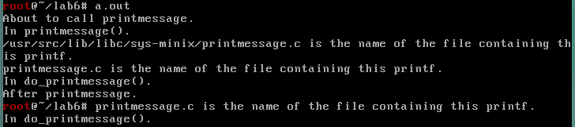
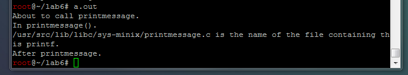

# Part 1. Adding a System Call

## Authors
* David Kale
* Nathan Hernandez

## Solution
The following steps were performed to add a new system call to Minix:

1. Define a call number for PRINTMESSAGE in /usr/src/include/minix/callnr.h [Diff 1]
2. Add printmessage.c to c library at /usr/src/lib/libc/sys-minix [Code 1]
  * Additionally, add this file to /usr/src/lib/libc/sys-minix/Makefile.inc [Diff 2]
  * Add prototype for the printmessage function to /usr/src/include/unistd.h
3. Define system call in pm server
  1. Add prototype to /usr/src/servers/pm/proto.h [Diff 3]
  2. Add entry in system call table in /usr/src/servers/pm/table.c [Diff 4]
  3. Add implementation of system call in /usr/src/servers/pm/printmessage.c [Code 2]
    * Add this file to makefile at /usr/src/servers/pm/Makefile [Diff 5]
4. Rebuild *everything*

Sample output from running system call:


Interestingly, the bottom figure shows output when running through SSH. The output from the
system call only goes to the first console of the virtual machine, but cannot be seen in the
terminal running SSH.



## Diffs
1. diff /usr/src/include/minix/callnr.h /usr/src-backup/include/minix/callnr.h
  ```
  38d37
  < #define PRINTMESSAGE  35
  ```

2. diff /usr/src/lib/libc/sys-minix/Makefile.inc /usr/src-backup/lib/libc/sys-minix/Makefile.inc
  ```
  12c12
  <       open.c pathconf.c pipe.c poll.c pread.c printmessage.c ptrace.c pwrite.c \
  ---
  >       open.c pathconf.c pipe.c poll.c pread.c ptrace.c pwrite.c \
  ```

3. diff -r /usr/src/servers/pm/proto.h /usr/src-backup/servers/pm/proto.h
  ```
  10,12d9
  < /* printmessage.c */
  < int do_printmessage();
  <
  ```

4. diff -r /usr/src/servers/pm/table.c /usr/src-backup/servers/pm/table.c
  ```
  49c49
  <       do_printmessage, /* 35 = printmessage   */
  ---
  >       no_sys,         /* 35 = unused  */
  ```

5. diff -r /usr/src/servers/pm/Makefile /usr/src-backup/servers/pm/Makefile
  ```
  7c7
  <       profile.c schedule.c printmessage.c
  ---
  >       profile.c schedule.c
  ```

## Code listings
1. /usr/src/lib/libc/sys-minix/printmessage.c
  ```
  #include <sys/cdefs.h>
  #include "namespace.h"
  #include <lib.h>
  #include <stdio.h>
  #include <unistd.h>
  #include <minix/callnr.h>
  
  int printmessage()
  {
      printf("In printmessage().\n");
      printf(__FILE__" is the name of the file containing this printf.\n");
      message m;
      return(_syscall(PM_PROC_NR, PRINTMESSAGE, &m));
  }
  ```

2. /usr/src/servers/pm/printmessage.c
  ```
  #include <stdio.h>
  #include "pm.h"
  #include <sys/wait.h>
  #include <assert.h>
  #include <minix/callnr.h>
  #include <minix/com.h>
  #include <minix/sched.h>
  #include <minix/vm.h>
  #include <sys/ptrace.h>
  #include <sys/resource.h>
  #include <signal.h>
  #include "mproc.h"
  #include "param.h"
  
  int do_printmessage()
  {
      printf(__FILE__" is the name of the file containing this printf.\n");
      printf("In do_printmessage().\n");
      return 0;
  }
  ```
